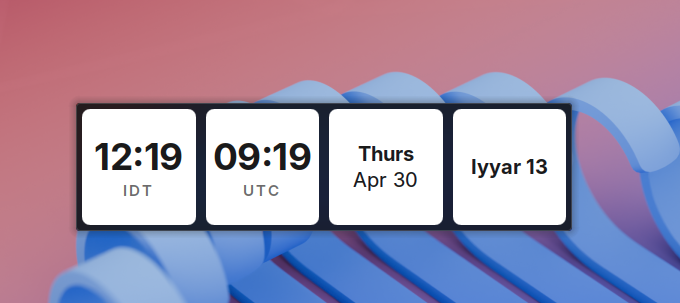
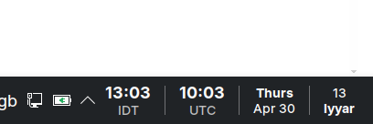
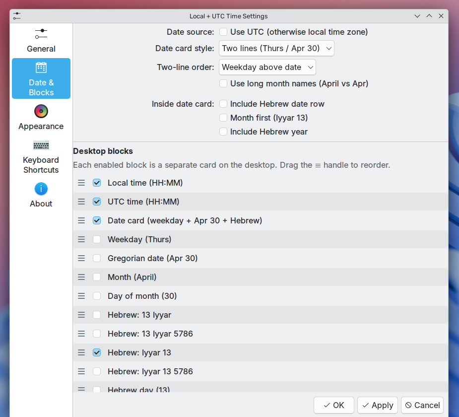

# KDE Time Blocks Widget (Plasma 6)

Modular desktop time and date cards for KDE Plasma 6 — local time, UTC, Gregorian date, and optional Hebrew calendar.

A modular Plasma 6 desktop widget that renders time, date, and (optionally) Hebrew date as side-by-side cards — handy for ops, aviation, comms with remote teams, or anyone who works against UTC. Also rolls in Hebrew calendar display, replacing the standalone `Hebrew-Date-KDE-Widget`.


### Default layout (local + UTC + date)


### With Hebrew date card enabled



### In the system tray (with Hebrew block)



### Settings



## Features

- Modular cards: enable/disable and reorder local time, UTC time, date, and Hebrew date independently
- Optional timezone labels (auto-detected local abbreviation, or custom strings)
- Label position: underneath the time (default) or inline after it
- Optional UTC offset display next to the local label
- 12 / 24-hour format, optional seconds
- Date card layouts: single line or two lines (`Thurs / Apr 30`), long or short month names
- Hebrew date: day + month (`Iyyar 13`), with optional Hebrew year
- Optional sunset (shkiah) rollover for the Hebrew date — requires user-supplied latitude, longitude, and IANA timezone in the *Hebrew Calendar* settings page (no auto-geolocation; coordinates must be entered manually for predictable, offline-friendly behavior)
- Custom font family, size, bold, and colors for time and labels
- Adjustable gap between cards

## Install

### From the prebuilt .plasmoid

```bash
kpackagetool6 -t Plasma/Applet --install kde-time-blocks-widget.plasmoid
```

### From source

```bash
git clone https://github.com/danielrosehill/KDE-Time-Blocks-Widget.git
cd KDE-Time-Blocks-Widget
kpackagetool6 -t Plasma/Applet --install package
```

To update after pulling changes:

```bash
kpackagetool6 -t Plasma/Applet --upgrade package
```

To remove:

```bash
kpackagetool6 -t Plasma/Applet --remove com.danielrosehill.localutctime
```

After install, add it from the Plasma widget picker (right-click desktop or panel → *Add Widgets…* → search "Local + UTC Time").

## Configure

Right-click the widget → *Configure…* — all options live under **Appearance**.

## Requirements

- KDE Plasma 6.x
- Qt 6 / QtQuick (ships with Plasma 6)

## License

MIT
