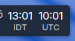

# Local + UTC Time Widget for KDE Plasma 6

A compact dual-clock plasmoid that shows your local time alongside UTC (Zulu) — handy for ops, aviation, comms with remote teams, or anyone who works against UTC.



## Features

- Side-by-side local + UTC clocks
- Optional timezone labels (auto-detected local abbreviation, or custom strings)
- Label position: underneath the time (default) or inline after it
- Optional UTC offset display next to the local label
- 12 / 24-hour format, optional seconds
- Optional date line below (`Thurs, Feb 9` style or weekday-only)
- Custom font family, size, bold, and colors for time and labels
- Adjustable gap between the two clocks

## Install

### From the prebuilt .plasmoid

```bash
kpackagetool6 -t Plasma/Applet --install local-utc-time-widget.plasmoid
```

### From source

```bash
git clone https://github.com/danielrosehill/Local-UTC-Time-Widget-KDE.git
cd Local-UTC-Time-Widget-KDE
kpackagetool6 -t Plasma/Applet --install package
```

To update after pulling changes:

```bash
kpackagetool6 -t Plasma/Applet --upgrade package
```

To remove:

```bash
kpackagetool6 -t Plasma/Applet --remove com.danielrosehill.localutctime
```

After install, add it from the Plasma widget picker (right-click desktop or panel → *Add Widgets…* → search "Local + UTC Time").

## Configure

Right-click the widget → *Configure…* — all options live under **Appearance**.

## Requirements

- KDE Plasma 6.x
- Qt 6 / QtQuick (ships with Plasma 6)

## License

MIT
